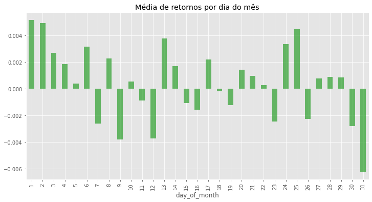
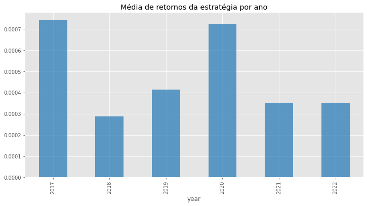
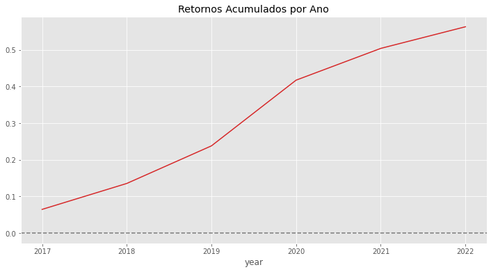
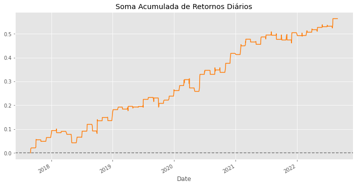

# Estratégia Início do Mês

### Esse estudo consiste na hipótese de que o ativo pode ter retornos positivos nos primeiros dias do mês.

* Foi feito um agrupamento por dias do mês para verificarmos nossa hipótese. E pela imagem abaixo podemos observar que os 6 primeiros dias tem, em média, retorno positivo.

* Em seguida pegamos os retornos dos 4 primeiros dias do mês e agrupamos por ano para verificar se os retornos são positivos. E podemos verificar que os retornos são positivos ao longo dos anos.

* E por fim geramos gráficos da soma acumulada dos retornos por ano e por dia.

